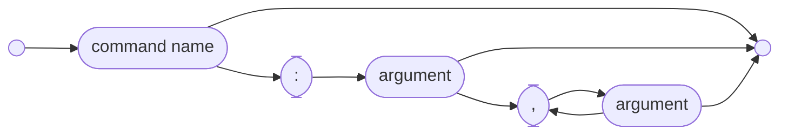

# The Basis Programming Language.  

#### Nota Bene
This is the programming language that I want to write code in, which doesn't actually exist yet.  

This's a part-time side project done at the pace of a parent's spare time, so it will be a while before the code here matches the intent.  Given that I can only work on this in little bursts, I'm following a doc-first strategy to use the doc as my spec so that I stay consistent.  I've percolated on this thing for years -- originally this was a purely functional language, but as I thought through details I realized that was the opposite of what's needed -- so I have a pretty solid understanding of what I want to achieve here, already.  But as Leslie Lamport pointed out, "writing is nature's way of telling you how lousy your thinking is".  

By the time I'm done this intro, anyone interested will be able to ask pointed questions and will know if awaiting the implementation's worthwhile.  &#9786;

## Core Semantics
Given program state as a tuple $\langle V,\Phi,\Sigma \rangle$ where
* V is the current verb to be executed:
    * $\overrightarrow{v}$ represents the continuation from $v$
    * $exec(c)$ executes a user defined command
    * $fail(\phi)$ sets a failure state
    * $recover$ recovers from a failure status
    * $recover(\phi,\sigma,c)$ recovers a particular failure state type, binding the failure to $\sigma$ in $exec(c)$
    * $scope(c)$ executes at the current scope boundary
    * $scopefail(c)$ executes c at the current scope boundary under a failure
    * $rewind(v)$ continues execution at a previous verb in the current scope
* $\Phi$ represents the current failure status:
    * $\epsilon$ represents no current failure
    * $\phi$ represents a particular failure
* $\Sigma$ represents the current variable state
    * $\sigma/c$ is sigma bound within the scope of c  

General excution is described by the following rules:

$$
\begin{align}
\text{normal execution}\quad & \langle v, \epsilon, \Sigma \rangle \Downarrow \langle v', \epsilon, \Sigma' \rangle & \implies & \langle \vec{v}, \epsilon, \Sigma' \rangle \\
\text{generating failure}\quad & v = fail(\phi) \quad \langle v, \epsilon, \Sigma \rangle & \implies & \langle \vec{v}, \phi, \Sigma \rangle \\
\text{command failure}\quad & \langle v, \epsilon, \Sigma \rangle \Downarrow \langle v', \phi, \Sigma' \rangle & \implies & \langle \vec{v}, \phi, \Sigma \rangle \\
\text{skips from failure}\quad & v \in \{exec(c),rewind(w),fail(\gamma)\} \quad \langle v, \phi, \Sigma \rangle & \implies & \langle \vec{v}, \phi, \Sigma \rangle \\
\text{generic recovery}\quad & v=recover \quad \langle v, \phi, \Sigma \rangle & \implies & \langle \vec{v}, \epsilon, \Sigma \rangle \\
\text{specific recovery}\quad & v=recover(\phi,\sigma,c) \quad \langle v, \phi, \Sigma \rangle & \implies & \langle c, \epsilon, \Sigma+\sigma/c \rangle \quad \vec{c} \leftarrow \vec{v} \\
\text{recovery failure}\quad & v=recover(\alpha,\sigma,c) \quad \langle v, \phi, \Sigma \rangle \quad \phi \neq \sigma & \implies & \langle \vec{v}, \phi, \Sigma \rangle \\
\text{scope boundary}\quad & v=scope(c) \quad \kappa\in\Phi \quad \langle v, \kappa, \Sigma \rangle & \implies & \langle c,\epsilon,\Sigma \rangle \quad \vec{c} \leftarrow \langle \vec{v},\kappa,\Sigma' \rangle \\
\text{scope boundary under failure}\quad & v=scopefail(c) \quad \langle v, \epsilon, \Sigma \rangle & \implies & \langle \vec{v},\epsilon,\Sigma \rangle \\
\text{} & v=scopefail(c) \quad \langle v, \phi, \Sigma \rangle & \implies & \langle c,\epsilon,\Sigma \rangle \quad \vec{c} \leftarrow \langle \vec{v},\phi,\Sigma' \rangle \\
\text{looping}\quad & v=rewind(c) \quad \langle v, \epsilon, \Sigma \rangle & \implies & \langle c,\epsilon,\Sigma \rangle
\end{align}
$$

## Overview
#### Hello World
Once things are in place, hello world will look like:
```
writeLn: "Hello, world!"
```

As a general rule, things get done via command invocation.  The basic syntax follows the following pattern:


The full syntax is a little more complicated, as we'll see soon.

### Data Types
