# Basis Grammar Reference

This document describes the grammar defined in `Grammar2.cpp`, starting from the top-level `COMPILATION_UNIT` production and working downward through all subordinate productions.

**Legend for Mermaid diagrams:**
- Rounded boxes `([...])` = token terminals
- Rectangles `[...]` = production references (sub-SPPFs)
- Diamonds `{...}` = decision points (alternatives / optional)
- Dashed borders indicate optional elements

---

## COMPILATION_UNIT

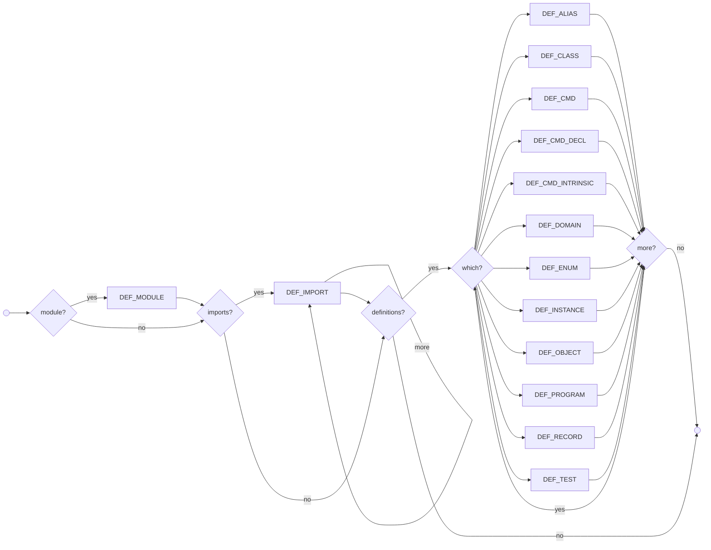

The top-level production for a source file. All three sections are optional.

| Alternative | Sub-productions referenced |
|---|---|
| Module declaration | **DEF_MODULE** |
| One or more imports | **DEF_IMPORT** (repeated) |
| One or more definitions | Any of: **DEF_ALIAS**, **DEF_CLASS**, **DEF_CMD**, **DEF_CMD_DECL**, **DEF_CMD_INTRINSIC**, **DEF_DOMAIN**, **DEF_ENUM**, **DEF_INSTANCE**, **DEF_OBJECT**, **DEF_PROGRAM**, **DEF_RECORD**, **DEF_TEST** |

---

## DEF_MODULE

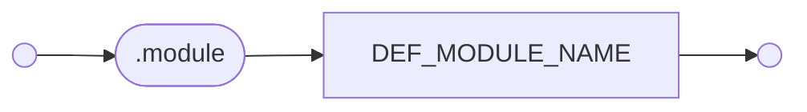

Declares the module name for the file. An exclusive group — consumes all tokens on the line.

| Alternative | Sub-productions referenced |
|---|---|
| `.module` TYPENAME | **DEF_MODULE_NAME** → **TYPENAME** |

---

## DEF_IMPORT

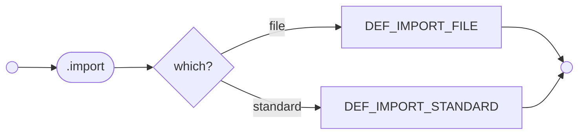

Imports a dependency. An exclusive group — consumes all tokens on the line.

| Alternative | Sub-productions referenced |
|---|---|
| File import: `.import` STRING | **DEF_IMPORT_FILE** → **STRING** |
| Standard import: `.import` [TYPENAME `:` ] TYPENAME | **DEF_IMPORT_STANDARD** → **TYPENAME_UNQUALIFIED**, **TYPENAME** |

---

## DEF_ENUM

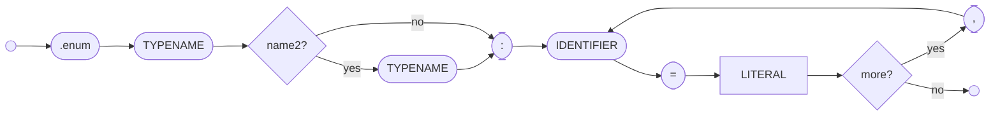

Defines an enumeration type. An exclusive group.

| Alternative | Sub-productions referenced |
|---|---|
| `.enum` TYPENAME [TYPENAME] `:` (IDENTIFIER `=` LITERAL) `,` ... | **DEF_ENUM_NAME1**, **DEF_ENUM_NAME2** (optional), **DEF_ENUM_ITEM_LIST** → **LITERAL** |

---

## DEF_DOMAIN

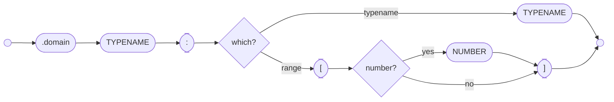

Defines a domain (constrained type). An exclusive group.

| Alternative | Sub-productions referenced |
|---|---|
| `.domain` TYPENAME `:` TYPENAME | **DEF_DOMAIN_NAME** → **TYPENAME**, **DEF_DOMAIN_PARENT** → **TYPENAME** |
| `.domain` TYPENAME `:` `[` [NUMBER] `]` | **DEF_DOMAIN_NAME** → **TYPENAME**, **DEF_DOMAIN_PARENT** → range expression |

---

## DEF_RECORD

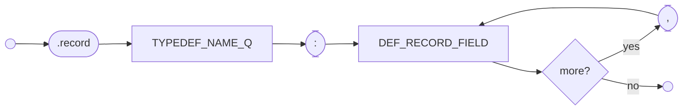

Defines a record type (value type with named fields). An exclusive group.

| Alternative | Sub-productions referenced |
|---|---|
| `.record` TYPEDEF_NAME_Q `:` DEF_RECORD_FIELD `,` ... | **DEF_RECORD_NAME** → **TYPEDEF_NAME_Q**, **DEF_RECORD_FIELDS** → **DEF_RECORD_FIELD** (comma-separated) |

### DEF_RECORD_FIELD

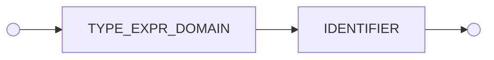

| Alternative | Sub-productions referenced |
|---|---|
| TYPE_EXPR_DOMAIN IDENTIFIER | **DEF_RECORD_FIELD_DOMAIN** → **TYPE_EXPR_DOMAIN**, **DEF_RECORD_FIELD_NAME** → **IDENTIFIER** |

---

## DEF_OBJECT

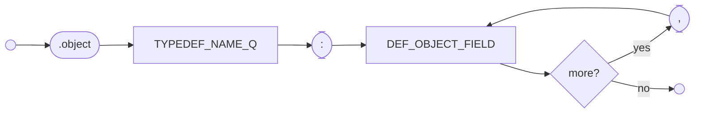

Defines an object type (reference type with named fields). An exclusive group.

| Alternative | Sub-productions referenced |
|---|---|
| `.object` TYPEDEF_NAME_Q `:` DEF_OBJECT_FIELD `,` ... | **DEF_OBJECT_NAME** → **TYPEDEF_NAME_Q**, **DEF_OBJECT_FIELDS** → **DEF_OBJECT_FIELD** (comma-separated) |

### DEF_OBJECT_FIELD

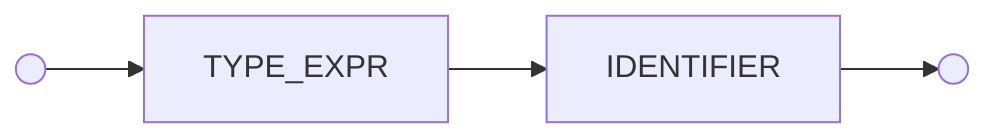

| Alternative | Sub-productions referenced |
|---|---|
| TYPE_EXPR IDENTIFIER | **DEF_OBJECT_FIELD_TYPE** → **TYPE_EXPR**, **DEF_OBJECT_FIELD_NAME** → **IDENTIFIER** |

---

## DEF_INSTANCE

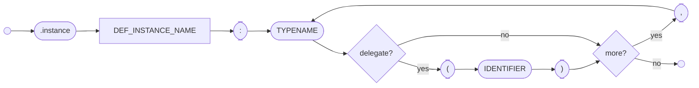

Declares that a type implements one or more interfaces, with optional delegation. An exclusive group.

| Alternative | Sub-productions referenced |
|---|---|
| `.instance` TYPEDEF_NAME_Q `:` (TYPENAME [`(` IDENTIFIER `)`]) `,` ... | **DEF_INSTANCE_NAME** → **TYPEDEF_NAME_Q**, **DEF_INSTANCE_TYPES** → **TYPENAME**, **DEF_INSTANCE_DELEGATE** (optional) |

---

## DEF_ALIAS

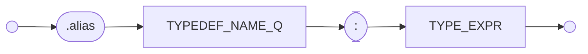

Defines a type alias. An exclusive group.

| Alternative | Sub-productions referenced |
|---|---|
| `.alias` TYPEDEF_NAME_Q `:` TYPE_EXPR | **TYPEDEF_NAME_Q**, **TYPE_EXPR** |

---

## DEF_PROGRAM

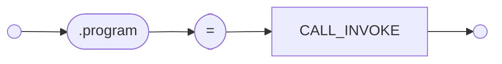

Defines the program entry point. An exclusive group.

| Alternative | Sub-productions referenced |
|---|---|
| `.program` `=` CALL_INVOKE | **CALL_INVOKE** |

---

## DEF_TEST

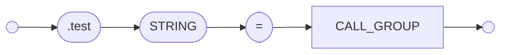

Defines a test case. An exclusive group.

| Alternative | Sub-productions referenced |
|---|---|
| `.test` STRING `=` CALL_GROUP | **STRING**, **CALL_GROUP** |

---

## DEF_CLASS

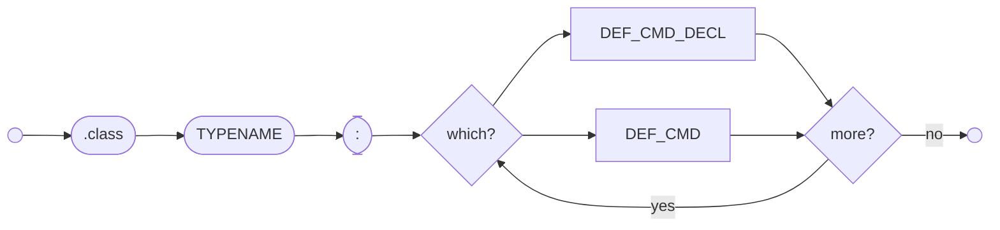

Defines a class containing one or more command declarations and/or definitions. An exclusive group.

| Alternative | Sub-productions referenced |
|---|---|
| `.class` TYPENAME `:` (DEF_CMD_DECL \| DEF_CMD)+ | **DEF_CLASS_NAME** → **TYPENAME**, **DEF_CLASS_CMDS** → one or more of **DEF_CMD_DECL** or **DEF_CMD** |

---

## DEF_CMD

```mermaid
flowchart LR
    Start(( )) --> CMD([.cmd])
    CMD --> choice{which?}
    choice -->|constructor| recv[DEF_CMD_RECEIVER]
    recv --> C1([: ])
    C1 --> parms1[DEF_CMD_PARM, ...]
    parms1 --> body[DEF_CMD_BODY]
    choice -->|destructor| ONEXIT([@ ])
    ONEXIT --> recv2[DEF_CMD_RECEIVER]
    recv2 --> body
    choice -->|fail handler| ONEXITFAIL(["@!"])
    ONEXITFAIL --> recv3[DEF_CMD_RECEIVER]
    recv3 --> body
    choice -->|vcommand| recvs["( receivers ) ::"]
    recvs --> nameSpec1[DEF_CMD_NAME_SPEC]
    nameSpec1 --> vparms[DEF_CMD_VPARMS]
    vparms --> imparms1[DEF_CMD_IMPARMS]
    imparms1 --> body
    choice -->|command| nameSpec2[DEF_CMD_NAME_SPEC]
    nameSpec2 --> parms2[DEF_CMD_PARMS]
    parms2 --> imparms2[DEF_CMD_IMPARMS]
    imparms2 --> body
    body --> End(( ))
```

Defines a command with a body. An exclusive group. Five alternatives based on the kind of command.

| Alternative | Sub-productions referenced |
|---|---|
| Constructor: `.cmd` DEF_CMD_RECEIVER `:` DEF_CMD_PARM, ... | **DEF_CMD_RECEIVER**, **DEF_CMD_PARM**, **DEF_CMD_BODY** |
| Destructor: `.cmd` `@` DEF_CMD_RECEIVER | **DEF_CMD_RECEIVER**, **DEF_CMD_BODY** |
| Failure handler: `.cmd` `@!` DEF_CMD_RECEIVER | **DEF_CMD_RECEIVER**, **DEF_CMD_BODY** |
| VCommand: `.cmd` `(` receivers `)` `::` DEF_CMD_NAME_SPEC DEF_CMD_VPARMS DEF_CMD_IMPARMS | **DEF_CMD_RECEIVERS**, **DEF_CMD_NAME_SPEC**, **DEF_CMD_VPARMS**, **DEF_CMD_IMPARMS**, **DEF_CMD_BODY** |
| Regular command: `.cmd` DEF_CMD_NAME_SPEC DEF_CMD_PARMS DEF_CMD_IMPARMS | **DEF_CMD_NAME_SPEC**, **DEF_CMD_PARMS**, **DEF_CMD_IMPARMS**, **DEF_CMD_BODY** |

---

## DEF_CMD_DECL

```mermaid
flowchart LR
    Start(( )) --> DECL([.decl])
    DECL --> choice{which?}
    choice -->|destructor| ONEXIT([@ ])
    ONEXIT --> recv1[DEF_CMD_RECEIVER]
    recv1 --> End(( ))
    choice -->|fail handler| ONEXITFAIL(["@!"])
    ONEXITFAIL --> recv2[DEF_CMD_RECEIVER]
    recv2 --> End
    choice -->|constructor| recv3[DEF_CMD_RECEIVER]
    recv3 --> C1([: ])
    C1 --> parms1[DEF_CMD_PARM, ...]
    parms1 --> End
    choice -->|vcommand| recvs["( receivers ) ::"]
    recvs --> nameSpec1[DEF_CMD_NAME_SPEC]
    nameSpec1 --> vparms[DEF_CMD_VPARMS]
    vparms --> imparms1[DEF_CMD_IMPARMS]
    imparms1 --> End
    choice -->|command| nameSpec2[DEF_CMD_NAME_SPEC]
    nameSpec2 --> parms2[DEF_CMD_PARMS]
    parms2 --> imparms2[DEF_CMD_IMPARMS]
    imparms2 --> End
```

Declares a command signature without a body. An exclusive group. Same five alternatives as DEF_CMD but without DEF_CMD_BODY.

| Alternative | Sub-productions referenced |
|---|---|
| Destructor: `.decl` `@` DEF_CMD_RECEIVER | **DEF_CMD_RECEIVER** |
| Failure handler: `.decl` `@!` DEF_CMD_RECEIVER | **DEF_CMD_RECEIVER** |
| Constructor: `.decl` DEF_CMD_RECEIVER `:` DEF_CMD_PARM, ... | **DEF_CMD_RECEIVER**, **DEF_CMD_PARM** |
| VCommand: `.decl` `(` receivers `)` `::` DEF_CMD_NAME_SPEC DEF_CMD_VPARMS DEF_CMD_IMPARMS | **DEF_CMD_RECEIVERS**, **DEF_CMD_NAME_SPEC**, **DEF_CMD_VPARMS**, **DEF_CMD_IMPARMS** |
| Regular command: `.decl` DEF_CMD_NAME_SPEC DEF_CMD_PARMS DEF_CMD_IMPARMS | **DEF_CMD_NAME_SPEC**, **DEF_CMD_PARMS**, **DEF_CMD_IMPARMS** |

---

## DEF_CMD_INTRINSIC

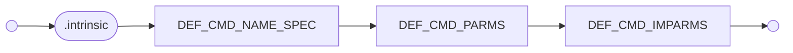

Declares an intrinsic (built-in) command. An exclusive group.

| Alternative | Sub-productions referenced |
|---|---|
| `.intrinsic` DEF_CMD_NAME_SPEC DEF_CMD_PARMS DEF_CMD_IMPARMS | **DEF_CMD_NAME_SPEC**, **DEF_CMD_PARMS**, **DEF_CMD_IMPARMS** |

---

## DEF_CMD_NAME_SPEC

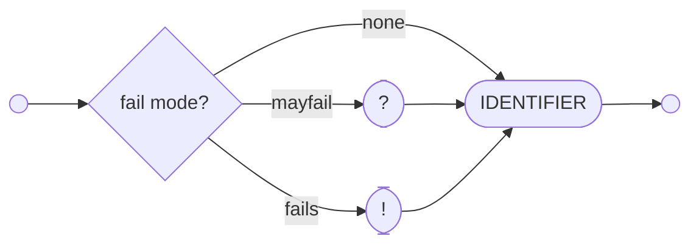

Specifies a command name with an optional failure annotation.

| Alternative | Sub-productions referenced |
|---|---|
| [`?` \| `!`] IDENTIFIER | **DEF_CMD_MAYFAIL** or **DEF_CMD_FAILS** (optional), **DEF_CMD_NAME** |

---

## DEF_CMD_PARMS

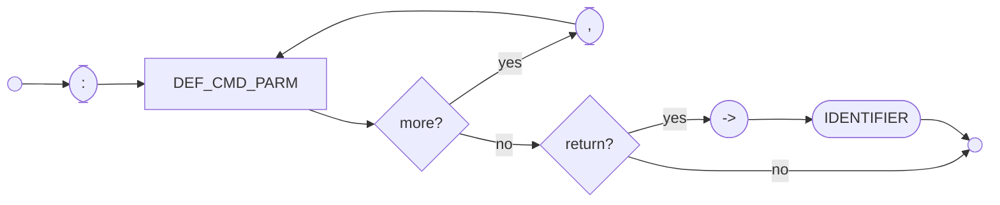

Parameter list for regular commands. Prefixed by `:`. Requires at least one parameter if a return value is present.

| Alternative | Sub-productions referenced |
|---|---|
| `:` DEF_CMD_PARM, ... [`->` IDENTIFIER] | **DEF_CMD_PARM** (comma-separated), **DEF_CMD_RETVAL** (optional) → **IDENTIFIER** |

---

## DEF_CMD_VPARMS

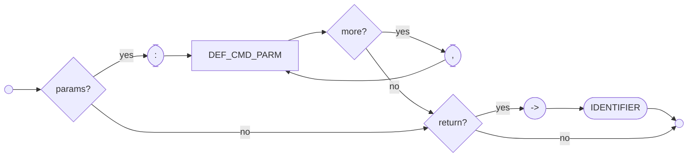

Parameter list for VCommands (commands with receivers). Both parameters and return value are independently optional.

| Alternative | Sub-productions referenced |
|---|---|
| [`:` DEF_CMD_PARM, ...] [`->` IDENTIFIER] | **DEF_CMD_PARMS** (optional), **DEF_CMD_RETVAL** (optional) |

---

## DEF_CMD_IMPARMS

```mermaid
flowchart LR
    Start(( )) --> optIm{implicit params?}
    optIm -->|yes| SLASH([/])
    SLASH --> parm[DEF_CMD_PARM]
    parm --> more{more?}
    more -->|yes| COMMA([,])
    COMMA --> parm
    more -->|no| End(( ))
    optIm -->|no| End
```

Optional implicit parameter list, prefixed by `/`.

| Alternative | Sub-productions referenced |
|---|---|
| [`/` DEF_CMD_PARM, ...] | **DEF_CMD_IMPARMS** → **DEF_CMD_PARM** (comma-separated, optional) |

---

## DEF_CMD_RECEIVERS

```mermaid
flowchart LR
    Start(( )) --> LP(["("])
    LP --> recv[DEF_CMD_RECEIVER]
    recv --> more{more?}
    more -->|yes| COMMA([,])
    COMMA --> recv
    more -->|no| RP([")"])
    RP --> DCOLON(["::"])
    DCOLON --> End(( ))
```

Receiver list for VCommands, enclosed in parentheses and followed by `::`.

| Alternative | Sub-productions referenced |
|---|---|
| `(` DEF_CMD_RECEIVER, ... `)` `::` | **DEF_CMD_RECEIVER** (comma-separated) |

---

## DEF_CMD_PARM

```mermaid
flowchart LR
    Start(( )) --> parmType[DEF_CMD_PARM_TYPE]
    parmType --> name([IDENTIFIER])
    name --> End(( ))
```

A single command parameter: a type followed by a name.

| Alternative | Sub-productions referenced |
|---|---|
| DEF_CMD_PARM_TYPE IDENTIFIER | **DEF_CMD_PARM_TYPE**, **DEF_CMD_PARM_NAME** |

---

## DEF_CMD_PARM_TYPE

```mermaid
flowchart LR
    Start(( )) --> choice{which?}
    choice -->|direct| DEF_CMD_PARMTYPE_NAME[DEF_CMD_PARMTYPE_NAME]
    choice -->|variable| DEF_CMD_PARMTYPE_VAR[DEF_CMD_PARMTYPE_VAR]
    DEF_CMD_PARMTYPE_NAME --> End(( ))
    DEF_CMD_PARMTYPE_VAR --> End
```

| Alternative | Sub-productions referenced |
|---|---|
| Direct type: TYPE_EXPR | **DEF_CMD_PARMTYPE_NAME** → **TYPE_EXPR** |
| Type variable: `(` TYPENAME `:` TYPE_EXPR `)` | **DEF_CMD_PARMTYPE_VAR** → **TYPENAME**, **DEF_CMD_PARMTYPE_NAME** → **TYPE_EXPR** |

---

## DEF_CMD_RECEIVER

```mermaid
flowchart LR
    Start(( )) --> type[DEF_CMD_PARMTYPE_NAME]
    type --> name([IDENTIFIER])
    name --> End(( ))
```

A receiver parameter (same structure as a regular parameter but uses DEF_CMD_PARMTYPE_NAME directly).

| Alternative | Sub-productions referenced |
|---|---|
| DEF_CMD_PARMTYPE_NAME IDENTIFIER | **DEF_CMD_PARMTYPE_NAME** → **TYPE_EXPR**, **DEF_CMD_PARM_NAME** |

---

## DEF_CMD_BODY

```mermaid
flowchart LR
    Start(( )) --> EQ([=])
    EQ --> choice{which?}
    choice -->|empty| UNDERSCORE(["_"])
    choice -->|body| CALL_GROUP[CALL_GROUP]
    UNDERSCORE --> End(( ))
    CALL_GROUP --> End
```

The body of a command definition. Begins with `=`, followed by either an empty marker (`_`) or a call group.

| Alternative | Sub-productions referenced |
|---|---|
| `=` `_` | **DEF_CMD_EMPTY** |
| `=` CALL_GROUP | **CALL_GROUP** |

---

## TYPE_EXPR

```mermaid
flowchart LR
    Start(( )) --> choice{which?}
    choice -->|named| TYPEDEF_NAME_Q[TYPEDEF_NAME_Q]
    choice -->|command| TYPE_EXPR_CMD[TYPE_EXPR_CMD]
    choice -->|pointer| TYPE_EXPR_PTR[TYPE_EXPR_PTR]
    TYPE_EXPR_PTR --> recurse1[TYPE_EXPR]
    choice -->|range| TYPE_EXPR_RANGE[TYPE_EXPR_RANGE]
    TYPE_EXPR_RANGE --> optRecurse{more?}
    optRecurse -->|yes| recurse2[TYPE_EXPR]
    optRecurse -->|no| End(( ))
    TYPEDEF_NAME_Q --> End
    TYPE_EXPR_CMD --> End
    recurse1 --> End
    recurse2 --> End
```

The general type expression. Four alternatives.

| Alternative | Sub-productions referenced |
|---|---|
| Named type | **TYPEDEF_NAME_Q** |
| Command type | **TYPE_EXPR_CMD** |
| Pointer to type: `^`+ TYPE_EXPR | **TYPE_EXPR_PTR**, **TYPE_EXPR** (recursive) |
| Range of type: `[` [size] `]` [TYPE_EXPR] | **TYPE_EXPR_RANGE**, **TYPE_EXPR** (optional recursive) |

---

## TYPE_EXPR_DOMAIN

```mermaid
flowchart LR
    Start(( )) --> choice{which?}
    choice -->|named| TYPE_NAME_Q[TYPE_NAME_Q]
    choice -->|range| TYPE_EXPR_RANGE_FIXED[TYPE_EXPR_RANGE_FIXED]
    TYPE_EXPR_RANGE_FIXED --> optRecurse{more?}
    optRecurse -->|yes| recurse[TYPE_EXPR_DOMAIN]
    optRecurse -->|no| End(( ))
    TYPE_NAME_Q --> End
    recurse --> End
```

Type expression restricted to domain contexts (records). Uses fixed-size ranges only.

| Alternative | Sub-productions referenced |
|---|---|
| Named type | **TYPE_NAME_Q** |
| Fixed range: `[` (IDENTIFIER \| NUMBER) `]` [TYPE_EXPR_DOMAIN] | **TYPE_EXPR_RANGE_FIXED**, **TYPE_EXPR_DOMAIN** (optional recursive) |

---

## TYPEDEF_NAME_Q

```mermaid
flowchart LR
    Start(( )) --> TN([TYPENAME])
    TN --> optParms{params?}
    optParms -->|yes| TYPEDEF_PARMS[TYPEDEF_PARMS]
    optParms -->|no| End(( ))
    TYPEDEF_PARMS --> End
```

A type name in a definition context, optionally with type definition parameters.

| Alternative | Sub-productions referenced |
|---|---|
| TYPENAME [TYPEDEF_PARMS] | **TYPENAME**, **TYPEDEF_PARMS** (optional) |

---

## TYPEDEF_PARMS

```mermaid
flowchart LR
    Start(( )) --> LB(["["])
    LB --> choice{which?}
    choice -->|value| TYPEDEF_PARM_VALUE[TYPEDEF_PARM_VALUE]
    choice -->|type| TYPEDEF_PARM_TYPE[TYPEDEF_PARM_TYPE]
    TYPEDEF_PARM_VALUE --> more{more?}
    TYPEDEF_PARM_TYPE --> more
    more -->|yes| COMMA([,])
    COMMA --> choice
    more -->|no| RB(["]"])
    RB --> End(( ))
```

Type definition parameter list enclosed in brackets.

| Alternative | Sub-productions referenced |
|---|---|
| `[` (TYPEDEF_PARM_VALUE \| TYPEDEF_PARM_TYPE), ... `]` | **TYPEDEF_PARM_VALUE**, **TYPEDEF_PARM_TYPE** (comma-separated) |

### TYPEDEF_PARM_TYPE

| Alternative | Sub-productions referenced |
|---|---|
| TYPE_NAME_Q [TYPENAME] | **TYPE_NAME_Q**, **TYPENAME** (optional — names the parameter) |

### TYPEDEF_PARM_VALUE

| Alternative | Sub-productions referenced |
|---|---|
| TYPENAME IDENTIFIER | **TYPENAME** (the domain), **IDENTIFIER** (the parameter name) |

---

## TYPE_NAME_Q

```mermaid
flowchart LR
    Start(( )) --> TN([TYPENAME])
    TN --> optArgs{args?}
    optArgs -->|yes| TYPE_NAME_ARGS[TYPE_NAME_ARGS]
    optArgs -->|no| End(( ))
    TYPE_NAME_ARGS --> End
```

A qualified type name in a usage context, optionally with type arguments.

| Alternative | Sub-productions referenced |
|---|---|
| TYPENAME [TYPE_NAME_ARGS] | **TYPENAME**, **TYPE_NAME_ARGS** (optional) |

---

## TYPE_NAME_ARGS

```mermaid
flowchart LR
    Start(( )) --> LB(["["])
    LB --> choice{which?}
    choice -->|value| TYPE_ARG_VALUE[TYPE_ARG_VALUE]
    choice -->|type| TYPE_ARG_TYPE[TYPE_ARG_TYPE]
    TYPE_ARG_VALUE --> more{more?}
    TYPE_ARG_TYPE --> more
    more -->|yes| COMMA([,])
    COMMA --> choice
    more -->|no| RB(["]"])
    RB --> End(( ))
```

Type argument list enclosed in brackets.

| Alternative | Sub-productions referenced |
|---|---|
| `[` (TYPE_ARG_VALUE \| TYPE_ARG_TYPE), ... `]` | **TYPE_ARG_VALUE** (NUMBER \| IDENTIFIER), **TYPE_ARG_TYPE** → **TYPE_NAME_Q** |

---

## TYPE_EXPR_PTR

```mermaid
flowchart LR
    Start(( )) --> CARAT(["^"])
    CARAT --> more{more?}
    more -->|yes| CARAT
    more -->|no| End(( ))
```

One or more pointer indirection markers (`^`).

| Alternative | Sub-productions referenced |
|---|---|
| `^`+ | (terminal tokens only) |

---

## TYPE_EXPR_RANGE

```mermaid
flowchart LR
    Start(( )) --> LB(["["])
    LB --> optSize{size?}
    optSize -->|identifier| ID([IDENTIFIER])
    optSize -->|number| NUM([NUMBER])
    optSize -->|none| RB(["]"])
    ID --> RB
    NUM --> RB
    RB --> End(( ))
```

An array/range type expression. The size is optional (for TYPE_EXPR_RANGE) or required (for TYPE_EXPR_RANGE_FIXED).

| Alternative | Sub-productions referenced |
|---|---|
| `[` [IDENTIFIER \| NUMBER] `]` | **IDENTIFIER** or **NUMBER** (optional size) |

---

## TYPE_EXPR_CMD

```mermaid
flowchart LR
    Start(( )) --> prefix{which?}
    prefix -->|nofail| COLANGLE([":<"])
    prefix -->|mayfail| QLANGLE(["?<"])
    prefix -->|fails| BANGLANGLE(["!<"])
    COLANGLE --> optArgs{args?}
    QLANGLE --> optArgs
    BANGLANGLE --> optArgs
    optArgs -->|yes| arg[TYPE_CMDEXPR_ARG]
    arg --> more{more?}
    more -->|yes| COMMA([,])
    COMMA --> arg
    more -->|no| RANGLE([">"])
    optArgs -->|no| RANGLE
    RANGLE --> End(( ))
```

A command type expression. The prefix indicates the failure mode.

| Alternative | Sub-productions referenced |
|---|---|
| (`:<` \| `?<` \| `!<`) [TYPE_CMDEXPR_ARG, ...] `>` | **TYPE_CMDEXPR_ARG** (comma-separated, optional) |

---

## TYPE_CMDEXPR_ARG

```mermaid
flowchart LR
    Start(( )) --> choice{which?}
    choice -->|named| TYPE_NAME_Q[TYPE_NAME_Q]
    choice -->|command| TYPE_EXPR_CMD[TYPE_EXPR_CMD]
    choice -->|pointer| TYPE_EXPR_PTR[TYPE_EXPR_PTR]
    TYPE_EXPR_PTR --> recurse1[TYPE_CMDEXPR_ARG]
    choice -->|range| TYPE_EXPR_RANGE[TYPE_EXPR_RANGE]
    TYPE_EXPR_RANGE --> optRecurse{more?}
    optRecurse -->|yes| recurse2[TYPE_CMDEXPR_ARG]
    optRecurse -->|no| optW{writeable?}
    TYPE_NAME_Q --> optW
    TYPE_EXPR_CMD --> optW
    recurse1 --> optW
    recurse2 --> optW
    optW -->|yes| APOS(["'"])
    optW -->|no| End(( ))
    APOS --> End
```

A single argument within a command type expression. Structurally similar to TYPE_EXPR but with an optional writeable marker (`'`).

| Alternative | Sub-productions referenced |
|---|---|
| TYPE_NAME_Q [`'`] | **TYPE_NAME_Q**, **WRITEABLE** (optional) |
| TYPE_EXPR_CMD [`'`] | **TYPE_EXPR_CMD**, **WRITEABLE** (optional) |
| TYPE_EXPR_PTR TYPE_CMDEXPR_ARG [`'`] | **TYPE_EXPR_PTR**, **TYPE_CMDEXPR_ARG** (recursive), **WRITEABLE** (optional) |
| TYPE_EXPR_RANGE [TYPE_CMDEXPR_ARG] [`'`] | **TYPE_EXPR_RANGE**, **TYPE_CMDEXPR_ARG** (optional recursive), **WRITEABLE** (optional) |

---

## CALL_GROUP

```mermaid
flowchart LR
    Start(( )) --> choice{which?}
    choice --> CALL_ASSIGNMENT[CALL_ASSIGNMENT]
    choice --> CALL_EXPRESSION[CALL_EXPRESSION]
    choice --> CALL_INVOKE[CALL_INVOKE]
    choice --> BLOCK[BLOCK]
    CALL_ASSIGNMENT --> more{more?}
    CALL_EXPRESSION --> more
    CALL_INVOKE --> more
    BLOCK --> more
    more -->|yes| choice
    more -->|no| End(( ))
```

A sequence of one or more statements within a command body.

| Alternative | Sub-productions referenced |
|---|---|
| (CALL_ASSIGNMENT \| CALL_EXPRESSION \| CALL_INVOKE \| BLOCK)+ | **CALL_ASSIGNMENT**, **CALL_EXPRESSION**, **CALL_INVOKE**, **BLOCK** |

---

## CALL_INVOKE

```mermaid
flowchart LR
    Start(( )) --> choice{which?}
    choice -->|vcommand| CALL_VCOMMAND[CALL_VCOMMAND]
    choice -->|constructor| CALL_CONSTRUCTOR[CALL_CONSTRUCTOR]
    choice -->|command| CALL_COMMAND[CALL_COMMAND]
    CALL_VCOMMAND --> End(( ))
    CALL_CONSTRUCTOR --> End
    CALL_COMMAND --> End
```

A command invocation. Three alternatives tried in order.

| Alternative | Sub-productions referenced |
|---|---|
| VCommand call | **CALL_VCOMMAND** |
| Constructor call | **CALL_CONSTRUCTOR** |
| Regular command call | **CALL_COMMAND** |

---

## CALL_COMMAND

```mermaid
flowchart LR
    Start(( )) --> target[CALL_CMD_TARGET]
    target --> optParms{params?}
    optParms -->|yes| COLON([: ])
    COLON --> parm[CALL_PARAMETER]
    parm --> more{more?}
    more -->|yes| COMMA([,])
    COMMA --> parm
    more -->|no| End(( ))
    optParms -->|no| End
```

A regular command call. Bounded group.

| Alternative | Sub-productions referenced |
|---|---|
| CALL_CMD_TARGET [`:` CALL_PARAMETER, ...] | **CALL_CMD_TARGET**, **CALL_PARAMETER** (comma-separated, optional) |

---

## CALL_CONSTRUCTOR

```mermaid
flowchart LR
    Start(( )) --> type[TYPE_NAME_Q]
    type --> COLON([: ])
    COLON --> parm[CALL_PARAMETER]
    parm --> more{more?}
    more -->|yes| COMMA([,])
    COMMA --> parm
    more -->|no| End(( ))
```

A constructor call. Bounded group.

| Alternative | Sub-productions referenced |
|---|---|
| TYPE_NAME_Q `:` CALL_PARAMETER, ... | **TYPE_NAME_Q**, **CALL_PARAMETER** (comma-separated) |

---

## CALL_VCOMMAND

```mermaid
flowchart LR
    Start(( )) --> LP(["("])
    LP --> id([IDENTIFIER])
    id --> moreR{more?}
    moreR -->|yes| COMMA1([,])
    COMMA1 --> id
    moreR -->|no| RP([")"])
    RP --> DCOLON(["::"])
    DCOLON --> name([IDENTIFIER])
    name --> optParms{params?}
    optParms -->|yes| COLON([: ])
    COLON --> parm[CALL_PARAMETER]
    parm --> moreP{more?}
    moreP -->|yes| COMMA2([,])
    COMMA2 --> parm
    moreP -->|no| End(( ))
    optParms -->|no| End
```

A virtual command call with receivers. Bounded group.

| Alternative | Sub-productions referenced |
|---|---|
| `(` IDENTIFIER, ... `)` `::` IDENTIFIER [`:` CALL_PARAMETER, ...] | **IDENTIFIER** (receivers), **IDENTIFIER** (command name), **CALL_PARAMETER** (optional) |

---

## CALL_ASSIGNMENT

```mermaid
flowchart LR
    Start(( )) --> target[CALL_IDENTIFIER]
    target --> LARROW(["<-"])
    LARROW --> expr[SUBCALL_EXPRESSION]
    expr --> optPipe{pipe?}
    optPipe -->|yes| PIPE(["|"])
    PIPE --> expr2[SUBCALL_EXPRESSION]
    expr2 --> optPipe
    optPipe -->|no| optOp{operator?}
    optOp -->|yes| op[CALL_OPERATOR]
    op --> rhs{which?}
    rhs --> invoke[CALL_INVOKE]
    rhs --> subexpr[SUBCALL_EXPRESSION]
    invoke --> moreOp{more ops?}
    subexpr --> moreOp
    moreOp -->|yes| op
    moreOp -->|no| End(( ))
    optOp -->|no| End
```

Assigns the result of an expression to a variable. Bounded group. Supports piping and post-assignment operators.

| Alternative | Sub-productions referenced |
|---|---|
| CALL_IDENTIFIER `<-` SUBCALL_EXPRESSION [\| SUBCALL_EXPRESSION]... [CALL_OPERATOR (CALL_INVOKE \| SUBCALL_EXPRESSION)]... | **CALL_IDENTIFIER**, **SUBCALL_EXPRESSION**, **CALL_OPERATOR**, **CALL_INVOKE** |

---

## CALL_EXPRESSION

```mermaid
flowchart LR
    Start(( )) --> term1[CALL_EXPR_TERM]
    term1 --> op[CALL_OPERATOR]
    op --> term2[CALL_EXPR_TERM]
    term2 --> more{more?}
    more -->|yes| op2[CALL_OPERATOR]
    op2 --> term3[CALL_EXPR_TERM]
    term3 --> more
    more -->|no| End(( ))
```

A top-level expression (requires at least one operator). Used in CALL_GROUP.

| Alternative | Sub-productions referenced |
|---|---|
| CALL_EXPR_TERM (CALL_OPERATOR CALL_EXPR_TERM)+ | **CALL_EXPR_TERM**, **CALL_OPERATOR** |

---

## SUBCALL_EXPRESSION

```mermaid
flowchart LR
    Start(( )) --> choice{which?}
    choice -->|cmd literal| CALL_CMD_LITERAL[CALL_CMD_LITERAL]
    choice -->|quote| CALL_QUOTE[CALL_QUOTE]
    choice -->|expr| term[CALL_EXPR_TERM]
    term --> optOps{operators?}
    optOps -->|yes| op[CALL_OPERATOR]
    op --> term2[CALL_EXPR_TERM]
    term2 --> moreOps{more?}
    moreOps -->|yes| op
    moreOps -->|no| End(( ))
    optOps -->|no| End
    CALL_CMD_LITERAL --> End
    CALL_QUOTE --> End
```

A sub-expression used within assignments and parameters. Operators are optional (unlike CALL_EXPRESSION).

| Alternative | Sub-productions referenced |
|---|---|
| Command literal | **CALL_CMD_LITERAL** |
| Quoted block | **CALL_QUOTE** |
| CALL_EXPR_TERM [CALL_OPERATOR CALL_EXPR_TERM]... | **CALL_EXPR_TERM**, **CALL_OPERATOR** (optional chain) |

---

## CALL_EXPR_TERM

```mermaid
flowchart LR
    Start(( )) --> choice{which?}
    choice -->|literal| LIT[LITERAL]
    choice -->|enum deref| TN([TYPENAME])
    TN --> LB(["["])
    LB --> ID([IDENTIFIER])
    ID --> RB(["]"])
    choice -->|invoke| CALL_INVOKE[CALL_INVOKE]
    choice -->|identifier| IDENT[IDENTIFIER]
    choice -->|paren| LP(["("])
    LP --> sub[SUBCALL_EXPRESSION]
    sub --> RP([")"])
    LIT --> optSuffix{suffix?}
    RB --> optSuffix
    CALL_INVOKE --> optSuffix
    IDENT --> optSuffix
    RP --> optSuffix
    optSuffix -->|yes| CALL_EXPR_SUFFIX[CALL_EXPR_SUFFIX]
    optSuffix -->|no| End(( ))
    CALL_EXPR_SUFFIX --> End
```

A single term in an expression, optionally followed by suffix operations (dereference, index, address-of).

| Alternative | Sub-productions referenced |
|---|---|
| LITERAL [suffix] | **LITERAL**, **CALL_EXPR_SUFFIX** (optional) |
| TYPENAME `[` IDENTIFIER `]` [suffix] — enum dereference | **TYPENAME**, **IDENTIFIER**, **CALL_EXPR_SUFFIX** (optional) |
| CALL_INVOKE [suffix] | **CALL_INVOKE**, **CALL_EXPR_SUFFIX** (optional) |
| IDENTIFIER [suffix] | **IDENTIFIER**, **CALL_EXPR_SUFFIX** (optional) |
| `(` SUBCALL_EXPRESSION `)` [suffix] | **SUBCALL_EXPRESSION**, **CALL_EXPR_SUFFIX** (optional) |

---

## CALL_EXPR_SUFFIX

```mermaid
flowchart LR
    Start(( )) --> optDerefIdx{deref/index?}
    optDerefIdx -->|deref| CARAT(["^"])
    optDerefIdx -->|index| CALL_EXPR_INDEX[CALL_EXPR_INDEX]
    CARAT --> more{more?}
    CALL_EXPR_INDEX --> more
    more -->|yes| optDerefIdx
    more -->|no| optAddr{address?}
    optDerefIdx -->|none| optAddr
    optAddr -->|yes| AMP(["&"])
    optAddr -->|no| End(( ))
    AMP --> End
```

Suffix operations on an expression term: zero or more dereferences/indexes, then an optional address-of.

| Alternative | Sub-productions referenced |
|---|---|
| (`^` \| CALL_EXPR_INDEX)* [`&`] | **CALL_EXPR_DEREF**, **CALL_EXPR_INDEX**, **CALL_EXPR_ADDR** |

### CALL_EXPR_INDEX

```mermaid
flowchart LR
    Start(( )) --> LB(["["])
    LB --> expr1[SUBCALL_EXPRESSION]
    expr1 --> optSecond{second?}
    optSecond -->|yes| COMMA([,])
    COMMA --> expr2[SUBCALL_EXPRESSION]
    expr2 --> RB(["]"])
    optSecond -->|no| RB
    RB --> End(( ))
```

| Alternative | Sub-productions referenced |
|---|---|
| `[` SUBCALL_EXPRESSION [`,` SUBCALL_EXPRESSION] `]` | **SUBCALL_EXPRESSION** (one or two) |

---

## CALL_OPERATOR

```mermaid
flowchart LR
    Start(( )) --> choice{which?}
    choice --> PLUS([+])
    choice --> MINUS([-])
    choice --> ASTERISK([*])
    choice --> SLASH([/])
    choice --> LANGLE(["<"])
    choice --> RANGLE([">"])
    choice --> LEQUALS(["<="])
    choice --> GREQUALS([">="])
    choice --> EQUALS(["="])
    choice --> INSERT(["<<"])
    choice --> EXTRACT([">>"])
```

One of the binary operators.

| Alternative | Sub-productions referenced |
|---|---|
| `+` \| `-` \| `*` \| `/` \| `<` \| `>` \| `<=` \| `>=` \| `=` \| `<<` \| `>>` | (terminal tokens only) |

---

## CALL_CMD_TARGET

```mermaid
flowchart LR
    Start(( )) --> choice{which?}
    choice -->|exec quote| DOLLAR(["$"])
    DOLLAR --> optExit{exit mode?}
    optExit -->|on_exit| AT(["@"])
    optExit -->|on_exit_fail| ATBANG(["@!"])
    optExit -->|none| target1{which?}
    AT --> target1
    ATBANG --> target1
    target1 -->|quote| CALL_QUOTE[CALL_QUOTE]
    target1 -->|ident| ID1([IDENTIFIER])
    choice -->|identifier| ID2([IDENTIFIER])
    CALL_QUOTE --> End(( ))
    ID1 --> End
    ID2 --> End
```

The target of a command call. Can be a simple identifier or an exec-quoted expression.

| Alternative | Sub-productions referenced |
|---|---|
| `$` [`@` \| `@!`] CALL_QUOTE | **EXEC_CMD**, **ON_EXIT** or **ON_EXIT_FAIL** (optional), **CALL_QUOTE** |
| `$` [`@` \| `@!`] IDENTIFIER | **EXEC_CMD**, **ON_EXIT** or **ON_EXIT_FAIL** (optional), **IDENTIFIER** |
| IDENTIFIER | **IDENTIFIER** |

---

## CALL_IDENTIFIER

```mermaid
flowchart LR
    Start(( )) --> choice{which?}
    choice -->|alloc| POUND(["#"])
    POUND --> ID1[IDENTIFIER]
    choice -->|normal| ID2[IDENTIFIER]
    ID1 --> End(( ))
    ID2 --> End
```

An identifier in a call context. The `#` prefix marks an allocation.

| Alternative | Sub-productions referenced |
|---|---|
| `#` IDENTIFIER | **ALLOC_IDENTIFIER** → **IDENTIFIER** |
| IDENTIFIER | **IDENTIFIER** |

---

## CALL_PARAMETER

```mermaid
flowchart LR
    Start(( )) --> choice{which?}
    choice -->|empty| UNDERSCORE(["_"])
    choice -->|expr| CALL_PARM_EXPR[CALL_PARM_EXPR]
    UNDERSCORE --> End(( ))
    CALL_PARM_EXPR --> End
```

A single parameter in a command call.

| Alternative | Sub-productions referenced |
|---|---|
| `_` (empty/placeholder) | **CALL_PARM_EMPTY** |
| SUBCALL_EXPRESSION \| CALL_IDENTIFIER | **CALL_PARM_EXPR** → **SUBCALL_EXPRESSION** or **CALL_IDENTIFIER** |

---

## CALL_QUOTE

```mermaid
flowchart LR
    Start(( )) --> choice{which?}
    choice -->|subquote| LB(["{"])
    LB --> optInvoke{content?}
    optInvoke -->|yes| CALL_INVOKE[CALL_INVOKE]
    optInvoke -->|no| RB(["}"])
    CALL_INVOKE --> RB
    RB --> End(( ))
    choice -->|nofail block| COLBRACE([":{"])
    COLBRACE --> body1{which?}
    body1 --> empty1[DEF_CMD_EMPTY]
    body1 --> group1[CALL_GROUP]
    empty1 --> RB1(["}"])
    group1 --> RB1
    RB1 --> End
    choice -->|fail block| BANGBRACE(["!{"])
    BANGBRACE --> body2{which?}
    body2 --> empty2[DEF_CMD_EMPTY]
    body2 --> group2[CALL_GROUP]
    empty2 --> RB2(["}"])
    group2 --> RB2
    RB2 --> End
    choice -->|mayfail block| QBRACE(["?{"])
    QBRACE --> body3{which?}
    body3 --> empty3[DEF_CMD_EMPTY]
    body3 --> group3[CALL_GROUP]
    empty3 --> RB3(["}"])
    group3 --> RB3
    RB3 --> End
```

A quoted block of code. Either a simple subquote or a block quote with a failure mode prefix.

| Alternative | Sub-productions referenced |
|---|---|
| `{` [CALL_INVOKE] `}` — subquote | **CALL_INVOKE** (optional) |
| `:{` (DEF_CMD_EMPTY \| CALL_GROUP) `}` — no-fail block | **DEF_CMD_EMPTY** or **CALL_GROUP** |
| `!{` (DEF_CMD_EMPTY \| CALL_GROUP) `}` — fail block | **DEF_CMD_EMPTY** or **CALL_GROUP** |
| `?{` (DEF_CMD_EMPTY \| CALL_GROUP) `}` — may-fail block | **DEF_CMD_EMPTY** or **CALL_GROUP** |

---

## CALL_CMD_LITERAL

```mermaid
flowchart LR
    Start(( )) --> prefix{which?}
    prefix -->|nofail| COLANGLE([":<"])
    prefix -->|mayfail| QLANGLE(["?<"])
    prefix -->|fails| BANGLANGLE(["!<"])
    COLANGLE --> optParms{params?}
    QLANGLE --> optParms
    BANGLANGLE --> optParms
    optParms -->|yes| parm[DEF_CMD_PARM]
    parm --> more{more?}
    more -->|yes| COMMA([,])
    COMMA --> parm
    more -->|no| RANGLE([">"])
    optParms -->|no| RANGLE
    RANGLE --> LBRACE(["{"])
    LBRACE --> body[CALL_GROUP]
    body --> RBRACE(["}"])
    RBRACE --> End(( ))
```

An inline command literal (lambda). Defines parameters and a body inline.

| Alternative | Sub-productions referenced |
|---|---|
| (`:<` \| `?<` \| `!<`) [DEF_CMD_PARM, ...] `>` `{` CALL_GROUP `}` | **DEF_CMD_PARM** (optional), **CALL_GROUP** |

---

## BLOCK

```mermaid
flowchart LR
    Start(( )) --> header[BLOCK_HEADER]
    header --> body[CALL_GROUP]
    body --> End(( ))
```

A control-flow block: a header specifying the block type, followed by a body. Bounded group.

| Alternative | Sub-productions referenced |
|---|---|
| BLOCK_HEADER CALL_GROUP | **BLOCK_HEADER**, **CALL_GROUP** |

---

## BLOCK_HEADER

```mermaid
flowchart LR
    Start(( )) --> choice{which?}
    choice --> DQMARK(["??"])
    choice --> QMARK(["?"])
    choice --> QMINUS(["?-"])
    choice --> MINUS(["-"])
    choice --> BANG(["!"])
    choice --> PERCENT(["%"])
    choice --> CARAT(["^"])
    choice --> pipeSpec(["|"])
    pipeSpec --> recoverChoice{recover spec?}
    recoverChoice -->|yes| RECOVER_SPEC[RECOVER_SPEC]
    RECOVER_SPEC --> RARROW(["->"])
    RARROW --> End(( ))
    recoverChoice -->|no| End
    choice --> AT(["@"])
    choice --> ATBANG(["@!"])
    DQMARK --> End(( ))
    QMARK --> End
    QMINUS --> End
    MINUS --> End
    BANG --> End
    PERCENT --> End
    CARAT --> End
    AT --> End
    ATBANG --> End
```

The header token that introduces a block, determining its control-flow semantics.

| Alternative | Sub-productions referenced |
|---|---|
| `??` — do-when-multi | (terminal) |
| `?` — do-when (conditional) | (terminal) |
| `?-` — do-when-fail | (terminal) |
| `-` — do-else | (terminal) |
| `!` — do-unless | (terminal) |
| `%` — do-block (unconditional) | (terminal) |
| `^` — do-rewind (loop) | (terminal) |
| `\|` RECOVER_SPEC `->` — do-recover with spec | **RECOVER_SPEC** |
| `\|` — do-recover (catch-all) | (terminal) |
| `@` — on-exit (destructor) | (terminal) |
| `@!` — on-exit-fail (failure handler) | (terminal) |

---

## RECOVER_SPEC

```mermaid
flowchart LR
    Start(( )) --> choice{which?}
    choice -->|typed| TYPE_NAME_Q[TYPE_NAME_Q]
    TYPE_NAME_Q --> ID([IDENTIFIER])
    ID --> End(( ))
    choice -->|term| CALL_EXPR_TERM[CALL_EXPR_TERM]
    CALL_EXPR_TERM --> End
```

Specifies what to recover in a recovery block.

| Alternative | Sub-productions referenced |
|---|---|
| TYPE_NAME_Q IDENTIFIER | **TYPE_NAME_Q**, **IDENTIFIER** |
| CALL_EXPR_TERM | **CALL_EXPR_TERM** |

---

## LITERAL

```mermaid
flowchart LR
    Start(( )) --> choice{which?}
    choice --> DECIMAL([DECIMAL])
    choice --> HEXNUMBER([HEXNUMBER])
    choice --> BINARY([BINARY])
    choice --> NUMBER([NUMBER])
    choice --> STRING([STRING])
    DECIMAL --> End(( ))
    HEXNUMBER --> End
    BINARY --> End
    NUMBER --> End
    STRING --> End
```

A literal value. Five token types.

| Alternative | Sub-productions referenced |
|---|---|
| DECIMAL | (terminal — decimal literal) |
| HEXNUMBER | (terminal — hex literal e.g. `0xFF`) |
| BINARY | (terminal — binary literal e.g. `0b1010`) |
| NUMBER | (terminal — integer literal) |
| STRING | (terminal — string literal) |

---

## TYPENAME

```mermaid
flowchart LR
    Start(( )) --> choice{which?}
    choice -->|qualified| TN1([TYPENAME])
    TN1 --> DCOLON(["::"])
    DCOLON --> TN2([TYPENAME])
    TN2 --> moreDC{more?}
    moreDC -->|yes| DCOLON2(["::"])
    DCOLON2 --> TN3([TYPENAME])
    TN3 --> moreDC
    moreDC -->|no| End(( ))
    choice -->|unqualified| TN([TYPENAME])
    TN --> End
```

A type name, either unqualified or qualified with `::` separators.

| Alternative | Sub-productions referenced |
|---|---|
| TYPENAME (`::` TYPENAME)+ — qualified | **QUALIFIED_TYPENAME** → **TYPENAME** tokens separated by `::` |
| TYPENAME — unqualified | **TYPENAME_UNQUALIFIED** (single TYPENAME token) |

---

## IDENTIFIER

```mermaid
flowchart LR
    Start(( )) --> optPrefix{qualified?}
    optPrefix -->|yes| TN([TYPENAME])
    TN --> DCOLON(["::"])
    DCOLON --> moreQ{more?}
    moreQ -->|yes| TN
    moreQ -->|no| ID([IDENTIFIER])
    optPrefix -->|no| ID
    ID --> End(( ))
```

An identifier, optionally qualified with one or more TYPENAME `::` prefixes.

| Alternative | Sub-productions referenced |
|---|---|
| [TYPENAME `::` ]... IDENTIFIER | **TYPENAME_UNQUALIFIED** (optional prefix chain), **IDENTIFIER** token |

